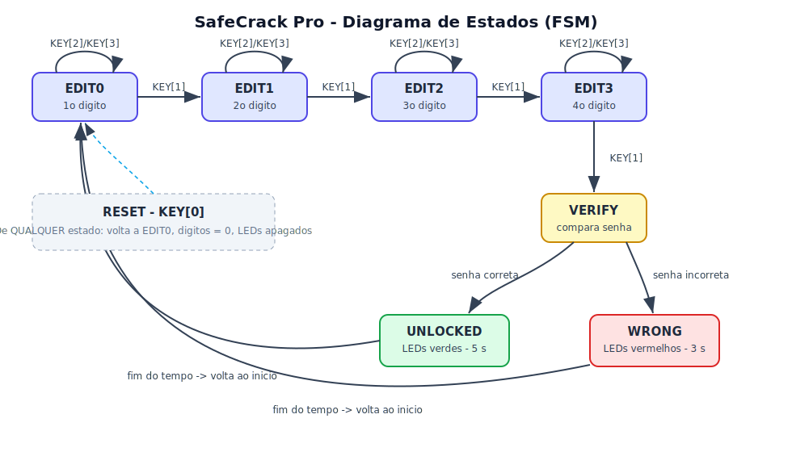
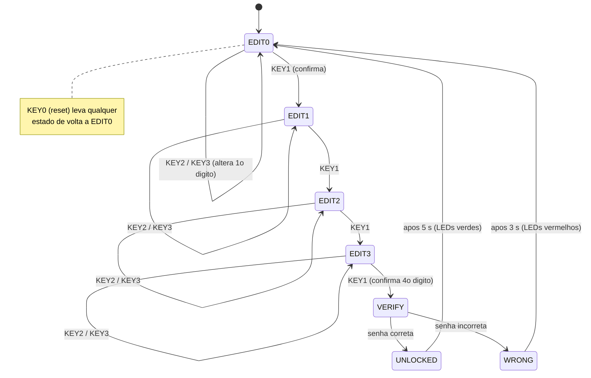
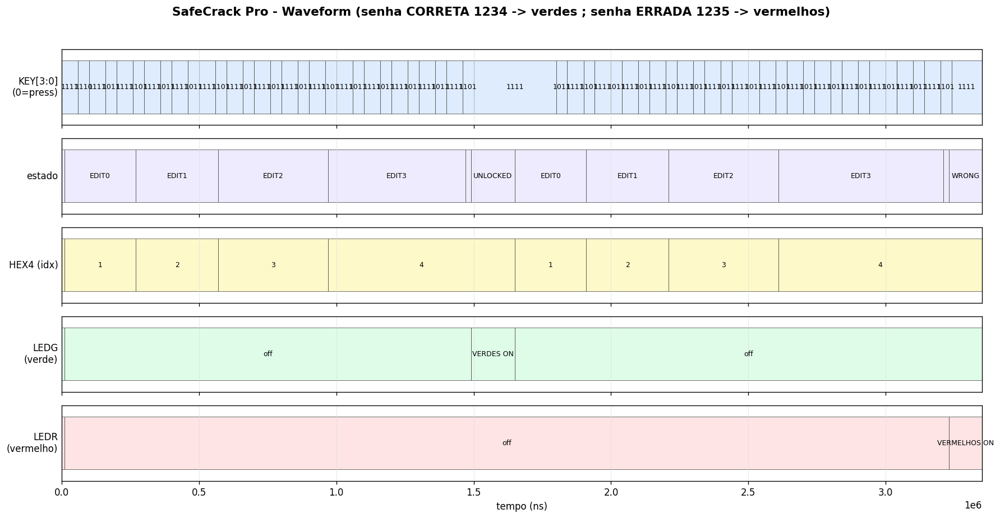

# Projeto Final de Sistemas Digitais (2026.1) · Prof. Victor Medeiros

## Integrantes:
- Leonardo Medeiros Kitner
- Lucas Veloso Moura Pereira
- Rafael Salles Mergulhão
- Rafael Vitor Santos Cavalcanti


Placa: **Terasic DE2-115** (FPGA Cyclone IV E — EP4CE115F29C7) · Linguagem: **SystemVerilog**

O sistema implementa um cofre cuja senha de **4 dígitos (0–9)** é composta um dígito por vez,
navegando com os push-buttons da placa. Cada dígito é confirmado individualmente; ao confirmar
o quarto dígito, o sistema compara com a senha correta e sinaliza o resultado pelos LEDs.

---

## 1. Estrutura do repositório

```
SafeCrackPro/
├── SafeCrackPro.sv          # Módulo top-level (a FSM completa)
├── SafeCrackPro_tb.sv       # Testbench para simulação
├── pinos_DE2-115.qsf        # Atribuição de pinos da DE2-115 (Quartus)
├── README.md                # Este arquivo
├── docs/
│   ├── diagrama_estados.svg     # Diagrama de estados (imagem)
│   └── waveform_simulacao.png   # Waveform gerado da simulação
└── sim/
    ├── run.do               # Script de compilação + simulação (ModelSim)
    └── wave.do              # Configuração das ondas no ModelSim
```

---

## 2. Como compilar e gravar na DE2-115 (Quartus)

1. Crie um novo projeto no Quartus tendo `SafeCrackPro` como **top-level entity**.
2. Adicione `SafeCrackPro.sv` ao projeto.
3. Importe os pinos: `Assignments > Import Assignments...` apontando para `pinos_DE2-115.qsf`
   (ou copie o conteúdo do arquivo para o `.qsf` do seu projeto).
4. `Processing > Start Compilation`.
5. Conecte a placa, abra o `Programmer`, carregue o `.sof` gerado e clique em **Start**.

> A senha padrão é **1 2 3 4** (igual à do vídeo de demonstração). Veja a seção 8 para alterá-la.

---

## 3. Como simular (ModelSim)

No console do ModelSim, dentro da pasta `sim/`:

```tcl
do run.do
```

O script cria a biblioteca, compila `SafeCrackPro.sv` e `SafeCrackPro_tb.sv`, abre a simulação,
carrega as ondas (`wave.do`) e roda até o fim. O testbench reduz os tempos de feedback
(parâmetros `OPEN_CYCLES`/`WRONG_CYCLES`) para a simulação rodar em poucos microssegundos —
no FPGA continuam valendo os 5 s e 3 s reais.

---

## 4. Implementação dos requisitos

### 4.1 Entrada por push-buttons e detecção de borda

Os quatro botões `KEY[3:0]` são **ativos em nível baixo** (pressionado = 0) e já são
**tratados em hardware** por um Schmitt Trigger na própria DE2-115 (debounce), conforme o manual.
Mesmo assim, para garantir **uma única ação por clique** (requisito explícito), a FSM detecta
apenas a **borda de descida** de cada botão:

```systemverilog
logic [3:0] key_d;
wire  [3:0] key_press = key_d & ~KEY;   // pulso de 1 ciclo quando 1 -> 0
// ...
key_d <= KEY;                            // registra o valor anterior a cada clock
```

Assim, segurar o botão pressionado **não** gera múltiplas ações: `key_press[k]` fica em 1
por apenas um ciclo de clock, no instante do pressionamento.

| Botão | Função | Efeito |
|-------|--------|--------|
| `KEY[3]` | seta esquerda | **decrementa** o dígito ativo (wrap: 0 → 9) |
| `KEY[2]` | seta direita | **incrementa** o dígito ativo (wrap: 9 → 0) |
| `KEY[1]` | confirma | fixa o dígito e avança; no 4º, dispara a verificação |
| `KEY[0]` | reset | volta ao estado inicial a qualquer momento |

### 4.2 Máquina de estados (FSM)

A FSM tem 7 estados (tipo `enum`):

- **EDIT0 … EDIT3** — edição do 1º, 2º, 3º e 4º dígito. Em cada um, `KEY[2]`/`KEY[3]` alteram
  **apenas** o dígito ativo (com wrap-around) e `KEY[1]` confirma e avança para o próximo.
  A navegação é **sempre para frente**: não há retorno a um dígito já confirmado.
- **VERIFY** — compara os quatro dígitos digitados com a senha correta (um ciclo de clock).
- **UNLOCKED** — senha correta: aciona **todos os LEDs verdes** por 5 s.
- **WRONG** — senha incorreta: aciona os **LEDs vermelhos** por 3 s.

Após o tempo de feedback, tanto `UNLOCKED` quanto `WRONG` retornam automaticamente a `EDIT0`,
com os dígitos zerados e os LEDs apagados.

### 4.3 Displays de 7 segmentos

Os displays da DE2-115 são de **anodo comum** (nível **baixo acende** o segmento). A conversão
BCD → 7 segmentos é feita pela função `seg7`, com a ordem de bits `{g,f,e,d,c,b,a}`.

| Display | Mostra |
|---------|--------|
| `HEX3` | 1º dígito da senha |
| `HEX2` | 2º dígito |
| `HEX1` | 3º dígito |
| `HEX0` | 4º dígito |
| `HEX4` | **índice do dígito ativo** (1 a 4) |

O `HEX4` indica claramente qual dígito está em edição (1 enquanto edita o 1º, 2 para o 2º, etc.),
exatamente como no vídeo de referência da placa.

### 4.4 Verificação e feedback (LEDs e temporização)

A temporização usa um contador (`timer`) sobre o clock de **50 MHz** da placa:

- **5 segundos** = 250 000 000 ciclos (`OPEN_CYCLES`)
- **3 segundos** = 150 000 000 ciclos (`WRONG_CYCLES`)

Esses valores são **parâmetros** do módulo, o que permite ao testbench usar valores pequenos
na simulação sem alterar o comportamento no hardware.

- **Senha correta** → `LEDG = 9'h1FF` (todos os 9 LEDs verdes acesos) por 5 s.
- **Senha incorreta** → `LEDR = 18'h3FFFF` (todos os 18 LEDs vermelhos acesos) por 3 s.

### 4.5 Reset

`KEY[0]` funciona como reset **sensível a nível**: enquanto pressionado, força a FSM a `EDIT0`,
zera os quatro dígitos, zera o `timer` e apaga os LEDs — independentemente do estado atual.
O valor anterior dos botões é registrado de forma a não gerar bordas falsas ao soltar o reset.

---

## 5. Diagrama de estados



Versão em Mermaid (renderiza direto no GitLab/GitHub):



---

## 6. Diagramas de tempo (waveforms)

O waveform abaixo foi gerado a partir do testbench (com tempos de feedback reduzidos para
caber na simulação). Ele cobre dois cenários: uma tentativa **correta** (1 2 3 4) seguida de
uma tentativa **incorreta** (1 2 3 5).



Leitura do waveform:

- **KEY[3:0]** — cada pulso para baixo é um clique. `1011` = `KEY[2]` (incrementa);
  `1101` = `KEY[1]` (confirma).
- **estado** — avança `EDIT0 → EDIT1 → EDIT2 → EDIT3` conforme os dígitos são confirmados,
  passa por `VERIFY` (1 ciclo) e cai em `UNLOCKED` (acerto) ou `WRONG` (erro).
- **HEX4 (idx)** — o índice do dígito ativo sobe de 1 a 4.
- **LEDG / LEDR** — ficam apagados durante a digitação; `LEDG` acende todo no acerto e
  `LEDR` acende todo no erro, voltando a apagar quando o sistema reseta.

> Para a entrega, inclua também **prints do próprio ModelSim** rodando `do run.do` — basta dar
> zoom nas transições de estado e nos LEDs. O `wave.do` já organiza os sinais (entradas, FSM,
> dígitos e saídas) para facilitar a captura.

---

## 7. Cenários de teste do testbench

O `SafeCrackPro_tb.sv` exercita:

1. **Senha correta (1 2 3 4)** → espera `UNLOCKED` e `LEDG` = todos acesos.
2. **Senha incorreta (1 2 3 5)** → espera `WRONG` e `LEDR` = todos acesos.
3. **Wrap-around** → em `EDIT0`, decrementar a partir de 0 leva o dígito a 9.
4. **Reset** (`KEY[0]`) → volta ao início com dígito ativo = 1 e displays em 0.

---

## 8. Como mudar a senha

A senha são os parâmetros `PASS0..PASS3` (PASS0 = 1º dígito = `HEX3`). Por exemplo, para `7 0 4 2`:

```systemverilog
SafeCrackPro #(.PASS0(4'd7), .PASS1(4'd0), .PASS2(4'd4), .PASS3(4'd2)) u_safe ( ... );
```

Ou edite diretamente os valores `default` no cabeçalho do módulo `SafeCrackPro`.

---

## 9. Bugs conhecidos / limitações (known issues)

- **Sem retorno a dígitos anteriores.** Por especificação, a navegação é só para frente; para
  corrigir um dígito já confirmado é preciso resetar (`KEY[0]`) e recomeçar. Não é um bug, mas
  é uma limitação intencional de usabilidade.
- **Reset por nível.** Enquanto `KEY[0]` está pressionado, o sistema permanece no estado inicial;
  ele só fica liberado para nova digitação quando o botão é solto.
- **Debounce.** O projeto confia no debounce em hardware dos botões (Schmitt Trigger da DE2-115)
  combinado com a detecção de borda. Em botões sem debounce de hardware seria necessário um
  contador de debounce adicional — não é o caso desta placa.
- **HEX5/HEX6/HEX7** não são usados e permanecem apagados (saídas não conectadas no módulo).

---

## 10. Mapeamento de pinos (resumo)

Os pinos foram retirados do *DE2-115 User Manual* e estão completos em `pinos_DE2-115.qsf`.
Resumo dos principais:

| Sinal | Pino | Sinal | Pino |
|-------|------|-------|------|
| `CLOCK_50` | PIN_Y2 | `KEY[0]` | PIN_M23 |
| `KEY[1]` | PIN_M21 | `KEY[2]` | PIN_N21 |
| `KEY[3]` | PIN_R24 | `HEX0[0]` | PIN_G18 |
| `HEX3[0]` | PIN_V21 | `HEX4[0]` | PIN_AB19 |
| `LEDG[0]` | PIN_E21 | `LEDR[0]` | PIN_G19 |

(Os 7 segmentos de cada display e todos os bits de `LEDG`/`LEDR` estão no `.qsf`.)

---


